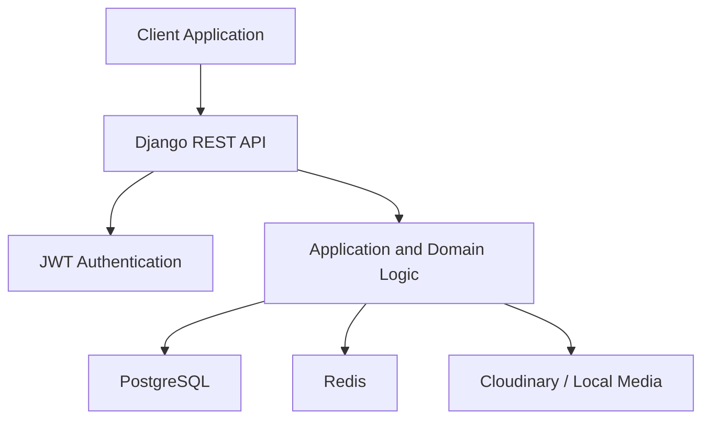
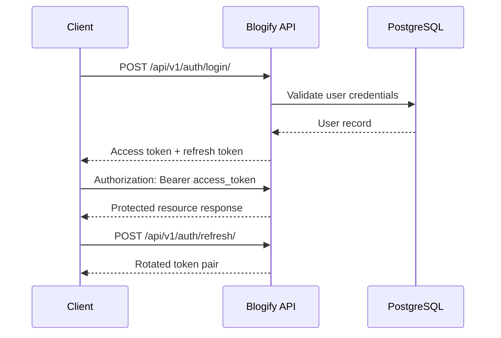
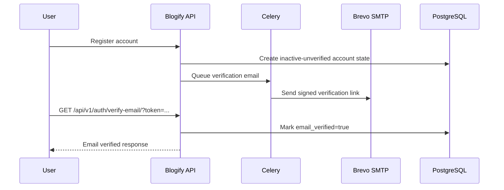
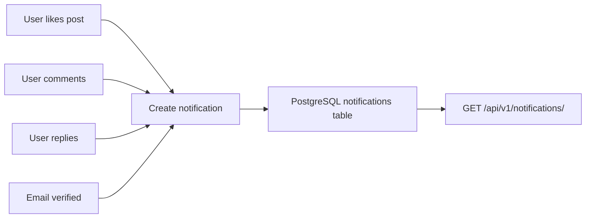
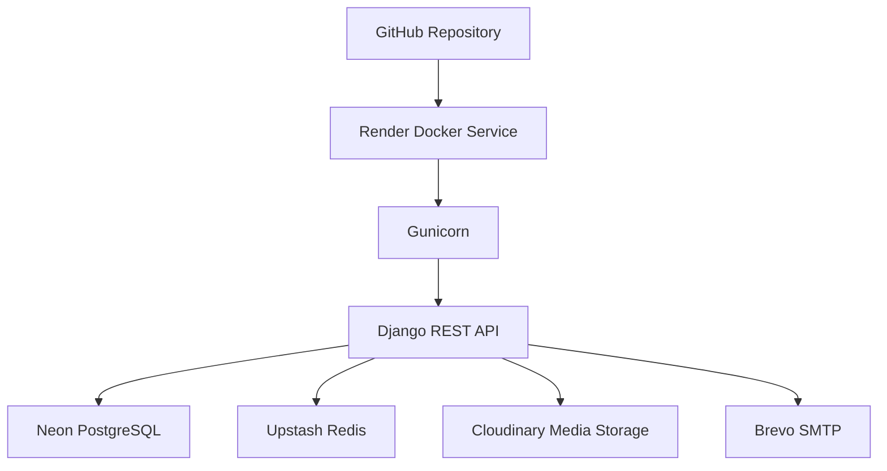

# Blogify API

> Production-ready REST API for a modern blogging platform, built with Django, Django REST Framework, PostgreSQL, Redis, Celery, JWT authentication, Cloudinary, and Render-ready Docker deployment.


## Live Links

| Resource | URL |
| --- | --- |
| Production API | `https://blogify-api-0ghm.onrender.com/` |
| Swagger UI | `https://blogify-api-0ghm.onrender.com/api/v1/docs/` |
| OpenAPI Schema | `https://blogify-api-0ghm.onrender.com/api/v1/schema/` |
| Health Check | `https://blogify-api-0ghm.onrender.com/health/` |
| Django Admin | `https://blogify-api-0ghm.onrender.com/admin/` |

Production base URL:

```text
https://blogify-api-0ghm.onrender.com
```

## Overview

Blogify API is a backend-only blogging platform designed to demonstrate production-grade API engineering. It provides account registration, JWT authentication, email verification, post publishing, categories, tags, comments, likes, bookmarks, notifications, admin management, OpenAPI documentation, background jobs, and deployment-ready infrastructure.

The project exists as a practical reference implementation for backend engineers who want to study a clean modular Django REST API with real-world concerns: authentication, permissions, idempotent startup tasks, structured responses, database-backed features, asynchronous email delivery, cloud media storage, containerized development, and Render production deployment.

## Feature Highlights

### Authentication and Accounts

- Custom email-based user model.
- JWT login with access and refresh tokens.
- Refresh token rotation and blacklist-backed logout.
- Current-user endpoint.
- Password change endpoint.
- Email verification with signed expiring tokens.
- Asynchronous verification email delivery through Celery.
- Django Admin support for managing users and content.

### Publishing

- Full post CRUD.
- Draft and published states.
- Author-owned editing.
- Staff/admin moderation.
- Automatic slug generation.
- Automatic reading-time calculation.
- Featured image upload support.
- Category and tag relationships.
- Public visibility for published posts.
- Draft visibility restricted to authors and staff.

### Engagement

- One-level nested comments.
- Like and unlike published posts.
- Bookmark and remove bookmarks.
- User-specific bookmark listing.
- Like count and user-specific like state on post responses.
- Bookmark state on post detail responses.

### Notifications

- Notifications for email verification, post likes, post comments, and comment replies.
- Authenticated notification listing.
- Mark one notification as read.
- Mark all notifications as read.

### Platform and Operations

- PostgreSQL support with `DATABASE_URL` for Neon.
- Redis support for Celery and cache-ready infrastructure.
- Cloudinary media storage in production.
- Brevo SMTP configuration.
- WhiteNoise static file serving.
- Gunicorn production startup.
- Docker and Docker Compose support.
- Health endpoint for database and Redis readiness.
- Swagger UI and OpenAPI schema via drf-spectacular.

## Tech Stack

| Area | Technology |
| --- | --- |
| Backend | Python 3.12+, Django 5.x, Django REST Framework |
| Database | PostgreSQL, Neon-compatible `DATABASE_URL` |
| Cache and Broker | Redis, Upstash-compatible URLs |
| Background Jobs | Celery, Celery Beat |
| Authentication | Simple JWT, refresh token rotation, token blacklist |
| Storage | Local media in development, Cloudinary in production |
| Email | Django email backend, Brevo SMTP in production |
| API Documentation | drf-spectacular, Swagger UI, OpenAPI schema |
| Deployment | Docker, Gunicorn, Render |
| Static Files | WhiteNoise compressed manifest storage |
| Testing and Quality | pytest, pytest-django, Black, isort, flake8 |
| CI/CD | Not configured in this repository yet |

## Architecture

### High-Level Request Flow



### Authentication Flow



### Email Verification Flow



### Notification Flow



### Deployment Architecture



More architecture detail lives in [docs/ARCHITECTURE.md](docs/ARCHITECTURE.md) and [docs/SYSTEM_DESIGN.md](docs/SYSTEM_DESIGN.md).

## Project Structure

```text
blogify-api/
  apps/
    accounts/        User model, JWT auth, email verification
    bookmarks/       Bookmark model and bookmark APIs
    comments/        Comment model, comment APIs, replies
    common/          Shared API, response, exception, permission, utility framework
    content/         Categories and tags
    core/            Health check, startup bootstrap, infrastructure tasks
    likes/           Like model and post-like APIs
    notifications/   Notification model, services, and APIs
    posts/           Post model, publishing workflow, filtering, search
  config/            Settings, URLs, ASGI/WSGI, Celery application
  docs/              Product, architecture, deployment, API, and ADR documentation
  requirements/      Base, development, testing, and production dependencies
  scripts/           Container entrypoint
  tests/             pytest suite and reusable testing helpers
```

## Installation

### Local Python Setup

```bash
python -m venv .venv
source .venv/bin/activate
pip install -r requirements/development.txt
cp .env.example .env
python manage.py check
python manage.py migrate
python manage.py runserver
```

On Windows PowerShell:

```powershell
.\.venv\Scripts\Activate.ps1
pip install -r requirements\development.txt
Copy-Item .env.example .env
python manage.py check
python manage.py migrate
python manage.py runserver
```

### Docker Setup

```bash
cp .env.example .env
docker compose up --build
```

The Docker web container waits for PostgreSQL, runs migrations, optionally bootstraps a superuser from environment variables, runs checks, and starts the Django development server locally.

### Background Workers

```bash
docker compose up celery-worker
docker compose up celery-beat
```

Run the infrastructure verification task from a running web container:

```bash
docker compose exec web celery -A config call apps.core.tasks.background_ping
```

## Environment Variables

| Variable | Purpose | Required | Default | Example |
| --- | --- | --- | --- | --- |
| `DJANGO_SETTINGS_MODULE` | Selects settings module | Yes | `config.settings.development` | `config.settings.production` |
| `DJANGO_ENVIRONMENT` | Runtime environment label | Yes | `development` | `production` |
| `DJANGO_SECRET_KEY` | Django signing secret | Yes in production | development fallback | `change-this` |
| `DJANGO_DEBUG` | Enables debug mode | No | `False` | `False` |
| `DJANGO_ALLOWED_HOSTS` | Allowed hostnames | Yes in production | `localhost,127.0.0.1` | `blogify-api.onrender.com` |
| `DJANGO_CSRF_TRUSTED_ORIGINS` | Trusted HTTPS origins | Recommended in production | empty | `https://blogify-api.onrender.com` |
| `APP_VERSION` | Health endpoint version | No | `1.0.0` | `1.0.0` |
| `GUNICORN_WORKERS` | Gunicorn worker count | No | `2` | `2` |
| `DATABASE_URL` | Neon/PostgreSQL connection URL | Production recommended | empty | `postgresql://...` |
| `POSTGRES_DB` | Local database name | Fallback | `blogify` | `blogify` |
| `POSTGRES_USER` | Local database user | Fallback | `blogify` | `blogify` |
| `POSTGRES_PASSWORD` | Local database password | Fallback | `blogify` | `blogify` |
| `POSTGRES_HOST` | Local database host | Fallback | `localhost` | `db` |
| `POSTGRES_PORT` | Database port | Fallback | `5432` | `5432` |
| `POSTGRES_CONN_MAX_AGE` | DB connection persistence | No | `60` | `600` |
| `POSTGRES_SSL_REQUIRE` | Require SSL for `DATABASE_URL` | No | production: `True` | `True` |
| `REDIS_URL` | Redis URL | Yes for Redis-backed features | `redis://localhost:6379/0` | Upstash Redis URL |
| `CELERY_BROKER_URL` | Celery broker URL | Yes for workers | `REDIS_URL` | Upstash Redis URL |
| `CELERY_RESULT_BACKEND` | Celery result backend | Yes for workers | `REDIS_URL` | Upstash Redis URL |
| `CLOUDINARY_URL` | Production media storage URL | Yes in production | empty | `cloudinary://...` |
| `EMAIL_HOST` | SMTP host | Yes for email | `smtp-relay.brevo.com` | `smtp-relay.brevo.com` |
| `EMAIL_PORT` | SMTP port | No | `587` | `587` |
| `EMAIL_HOST_USER` | SMTP username | Yes for email | empty | Brevo login |
| `EMAIL_HOST_PASSWORD` | SMTP password | Yes for email | empty | Brevo SMTP key |
| `EMAIL_USE_TLS` | SMTP TLS toggle | No | `True` | `True` |
| `DJANGO_DEFAULT_FROM_EMAIL` | Sender email | Recommended | `noreply@blogify.local` | `noreply@example.com` |
| `BLOGIFY_API_BASE_URL` | Base URL used in generated links | Recommended | `http://localhost:8000` | `https://blogify-api-0ghm.onrender.com` |
| `EMAIL_VERIFICATION_TOKEN_MAX_AGE_SECONDS` | Verification token lifetime | No | `86400` | `86400` |
| `DJANGO_SUPERUSER_USERNAME` | Optional startup superuser username | No | empty | `admin` |
| `DJANGO_SUPERUSER_EMAIL` | Optional startup superuser email | No | empty | `admin@example.com` |
| `DJANGO_SUPERUSER_PASSWORD` | Optional startup superuser password | No | empty | secure secret |

## API Documentation

- API version prefix: `/api/v1/`
- Swagger UI: `/api/v1/docs/`
- OpenAPI schema: `/api/v1/schema/`
- Authentication header: `Authorization: Bearer <access_token>`
- Default pagination: page-number pagination with `page` and `page_size`
- Default page size: `20`
- Maximum page size: `100`
- Supported request content types: JSON, form data, multipart form data
- Response format: JSON only

### Response Envelope

Success:

```json
{
  "data": {
    "id": "2f9c7c0d-2d4c-4c8c-9b77-56800f5e80a8"
  }
}
```

Paginated:

```json
{
  "data": [],
  "pagination": {
    "page": 1,
    "page_size": 20,
    "total_count": 0,
    "total_pages": 1,
    "next": null,
    "previous": null
  }
}
```

Error:

```json
{
  "error": {
    "code": "validation_error",
    "message": "Validation failed.",
    "details": {
      "email": ["This field is required."]
    }
  }
}
```

## Endpoint Reference

Complete production endpoint reference for Blogify API v1.0.

Base URL:

```text
https://blogify-api-0ghm.onrender.com
```

### Documentation and System

| Feature | Method | Endpoint | Auth Required |
| --- | --- | --- | --- |
| Health Check | `GET` | `https://blogify-api-0ghm.onrender.com/health/` | No |
| Swagger UI | `GET` | `https://blogify-api-0ghm.onrender.com/api/v1/docs/` | No |
| OpenAPI Schema | `GET` | `https://blogify-api-0ghm.onrender.com/api/v1/schema/` | No |
| Django Admin | `GET` | `https://blogify-api-0ghm.onrender.com/admin/` | Staff/superuser |

### Authentication

| Feature | Method | Endpoint | Auth Required |
| --- | --- | --- | --- |
| Register | `POST` | `https://blogify-api-0ghm.onrender.com/api/v1/auth/register/` | No |
| Login | `POST` | `https://blogify-api-0ghm.onrender.com/api/v1/auth/login/` | No |
| Refresh Token | `POST` | `https://blogify-api-0ghm.onrender.com/api/v1/auth/refresh/` | No |
| Logout | `POST` | `https://blogify-api-0ghm.onrender.com/api/v1/auth/logout/` | Yes |
| Current User | `GET` | `https://blogify-api-0ghm.onrender.com/api/v1/auth/me/` | Yes |
| Change Password | `PUT` | `https://blogify-api-0ghm.onrender.com/api/v1/auth/change-password/` | Yes |
| Resend Verification Email | `POST` | `https://blogify-api-0ghm.onrender.com/api/v1/auth/resend-verification/` | Yes |
| Verify Email | `GET` | `https://blogify-api-0ghm.onrender.com/api/v1/auth/verify-email/?token=<token>` | No |

### Posts

| Feature | Method | Endpoint | Auth Required |
| --- | --- | --- | --- |
| List Posts | `GET` | `https://blogify-api-0ghm.onrender.com/api/v1/posts/` | No |
| Create Post | `POST` | `https://blogify-api-0ghm.onrender.com/api/v1/posts/` | Yes |
| Retrieve Post | `GET` | `https://blogify-api-0ghm.onrender.com/api/v1/posts/{post_id}/` | Conditional visibility |
| Update Post | `PUT` | `https://blogify-api-0ghm.onrender.com/api/v1/posts/{post_id}/` | Yes |
| Partial Update Post | `PATCH` | `https://blogify-api-0ghm.onrender.com/api/v1/posts/{post_id}/` | Yes |
| Delete Post | `DELETE` | `https://blogify-api-0ghm.onrender.com/api/v1/posts/{post_id}/` | Yes |

Supported post query parameters include `category`, `tag`, `author`, `status`, `featured`, `search`, `ordering`, `page`, and `page_size`.

### Comments

| Feature | Method | Endpoint | Auth Required |
| --- | --- | --- | --- |
| List Comments for a Post | `GET` | `https://blogify-api-0ghm.onrender.com/api/v1/posts/{post_id}/comments/` | No |
| Create Comment | `POST` | `https://blogify-api-0ghm.onrender.com/api/v1/posts/{post_id}/comments/` | Yes |
| Update Comment | `PUT` | `https://blogify-api-0ghm.onrender.com/api/v1/comments/{comment_id}/` | Yes |
| Partial Update Comment | `PATCH` | `https://blogify-api-0ghm.onrender.com/api/v1/comments/{comment_id}/` | Yes |
| Delete Comment | `DELETE` | `https://blogify-api-0ghm.onrender.com/api/v1/comments/{comment_id}/` | Yes |

Comments do not currently expose a standalone `GET /api/v1/comments/{comment_id}/` retrieve endpoint. Comment reads are available through the post comments collection.

### Likes

| Feature | Method | Endpoint | Auth Required |
| --- | --- | --- | --- |
| Like Post | `POST` | `https://blogify-api-0ghm.onrender.com/api/v1/posts/{post_id}/like/` | Yes |
| Unlike Post | `DELETE` | `https://blogify-api-0ghm.onrender.com/api/v1/posts/{post_id}/like/` | Yes |

### Bookmarks

| Feature | Method | Endpoint | Auth Required |
| --- | --- | --- | --- |
| List My Bookmarks | `GET` | `https://blogify-api-0ghm.onrender.com/api/v1/bookmarks/` | Yes |
| Bookmark Post | `POST` | `https://blogify-api-0ghm.onrender.com/api/v1/posts/{post_id}/bookmark/` | Yes |
| Remove Bookmark | `DELETE` | `https://blogify-api-0ghm.onrender.com/api/v1/posts/{post_id}/bookmark/` | Yes |

### Notifications

| Feature | Method | Endpoint | Auth Required |
| --- | --- | --- | --- |
| List Notifications | `GET` | `https://blogify-api-0ghm.onrender.com/api/v1/notifications/` | Yes |
| Mark Notification as Read | `PATCH` | `https://blogify-api-0ghm.onrender.com/api/v1/notifications/{notification_id}/read/` | Yes |
| Mark All Notifications as Read | `PATCH` | `https://blogify-api-0ghm.onrender.com/api/v1/notifications/read-all/` | Yes |

### Categories

| Feature | Method | Endpoint | Auth Required |
| --- | --- | --- | --- |
| List Categories | `GET` | `https://blogify-api-0ghm.onrender.com/api/v1/categories/` | No |
| Create Category | `POST` | `https://blogify-api-0ghm.onrender.com/api/v1/categories/` | Staff/admin |
| Retrieve Category | `GET` | `https://blogify-api-0ghm.onrender.com/api/v1/categories/{category_id}/` | No |
| Update Category | `PUT` | `https://blogify-api-0ghm.onrender.com/api/v1/categories/{category_id}/` | Staff/admin |
| Partial Update Category | `PATCH` | `https://blogify-api-0ghm.onrender.com/api/v1/categories/{category_id}/` | Staff/admin |
| Delete Category | `DELETE` | `https://blogify-api-0ghm.onrender.com/api/v1/categories/{category_id}/` | Staff/admin |

### Tags

| Feature | Method | Endpoint | Auth Required |
| --- | --- | --- | --- |
| List Tags | `GET` | `https://blogify-api-0ghm.onrender.com/api/v1/tags/` | No |
| Create Tag | `POST` | `https://blogify-api-0ghm.onrender.com/api/v1/tags/` | Staff/admin |
| Retrieve Tag | `GET` | `https://blogify-api-0ghm.onrender.com/api/v1/tags/{tag_id}/` | No |
| Update Tag | `PUT` | `https://blogify-api-0ghm.onrender.com/api/v1/tags/{tag_id}/` | Staff/admin |
| Partial Update Tag | `PATCH` | `https://blogify-api-0ghm.onrender.com/api/v1/tags/{tag_id}/` | Staff/admin |
| Delete Tag | `DELETE` | `https://blogify-api-0ghm.onrender.com/api/v1/tags/{tag_id}/` | Staff/admin |

### API Summary

| Module | Endpoint Count |
| --- | ---: |
| Documentation and System | 4 |
| Authentication | 8 |
| Posts | 6 |
| Comments | 5 |
| Likes | 2 |
| Bookmarks | 3 |
| Notifications | 3 |
| Categories | 6 |
| Tags | 6 |
| Total Implemented Endpoints | 43 |

## API Examples

### Register

```bash
curl -X POST https://blogify-api-0ghm.onrender.com/api/v1/auth/register/ \
  -H "Content-Type: application/json" \
  -d '{
    "email": "reader@example.com",
    "username": "reader",
    "password": "StrongPassword123!",
    "password_confirm": "StrongPassword123!",
    "first_name": "Reader",
    "last_name": "One"
  }'
```

### Login

```bash
curl -X POST https://blogify-api-0ghm.onrender.com/api/v1/auth/login/ \
  -H "Content-Type: application/json" \
  -d '{"email": "reader@example.com", "password": "StrongPassword123!"}'
```

### Create Post

```bash
curl -X POST https://blogify-api-0ghm.onrender.com/api/v1/posts/ \
  -H "Authorization: Bearer <access_token>" \
  -F "title=Shipping a Django API" \
  -F "excerpt=Notes from building a production-ready backend." \
  -F "content=Long-form post content goes here." \
  -F "status=PUBLISHED" \
  -F "is_featured=false"
```

### List Posts

```bash
curl "https://blogify-api-0ghm.onrender.com/api/v1/posts/?search=django&ordering=newest&page=1&page_size=10"
```

## User Manual

An API is a way for software applications to communicate with each other. Blogify API lets a website, mobile app, or tool create accounts, publish posts, comment, like, bookmark, and read notifications by sending HTTP requests.

1. Open the Swagger page at `/api/v1/docs/`.
2. Register with `/api/v1/auth/register/`.
3. Log in with `/api/v1/auth/login/`.
4. Copy the `access` token from the response.
5. Click **Authorize** in Swagger and enter `Bearer <access_token>`.
6. Use authenticated endpoints such as creating posts, commenting, liking, bookmarking, and viewing notifications.

Image uploads use multipart form data. In Swagger, choose the post create or update endpoint and upload the file through the `featured_image` field.

Recommended screenshots:

- `docs/screenshots/swagger.png` - Swagger UI.
- `docs/screenshots/admin.png` - Django Admin.
- `docs/screenshots/health.png` - Health endpoint.
- `docs/screenshots/render.png` - Render deployment.

## Frontend Integration Guide

Set a single API base URL:

```js
const API_BASE_URL = "https://blogify-api-0ghm.onrender.com";
```

<details>
<summary>Vanilla JavaScript fetch</summary>

```js
async function login(email, password) {
  const response = await fetch(`${API_BASE_URL}/api/v1/auth/login/`, {
    method: "POST",
    headers: { "Content-Type": "application/json" },
    body: JSON.stringify({ email, password }),
  });
  const payload = await response.json();
  localStorage.setItem("accessToken", payload.data.tokens.access);
  localStorage.setItem("refreshToken", payload.data.tokens.refresh);
}

async function listPosts() {
  const response = await fetch(`${API_BASE_URL}/api/v1/posts/`);
  return response.json();
}
```

</details>

<details>
<summary>Axios</summary>

```js
import axios from "axios";

const api = axios.create({ baseURL: "https://blogify-api-0ghm.onrender.com" });

api.interceptors.request.use((config) => {
  const token = localStorage.getItem("accessToken");
  if (token) config.headers.Authorization = `Bearer ${token}`;
  return config;
});

export async function createPost(data) {
  return api.post("/api/v1/posts/", data);
}
```

</details>

<details>
<summary>React</summary>

```jsx
import { useEffect, useState } from "react";

export function PostList() {
  const [posts, setPosts] = useState([]);

  useEffect(() => {
    fetch("https://blogify-api-0ghm.onrender.com/api/v1/posts/")
      .then((response) => response.json())
      .then((payload) => setPosts(payload.data));
  }, []);

  return posts.map((post) => <article key={post.id}>{post.title}</article>);
}
```

</details>

<details>
<summary>Next.js</summary>

```ts
export async function getPosts() {
  const response = await fetch(`${process.env.NEXT_PUBLIC_API_URL}/api/v1/posts/`, {
    cache: "no-store",
  });
  return response.json();
}
```

</details>

<details>
<summary>Vue</summary>

```js
import { ref, onMounted } from "vue";

export function usePosts() {
  const posts = ref([]);
  onMounted(async () => {
    const response = await fetch("https://blogify-api-0ghm.onrender.com/api/v1/posts/");
    posts.value = (await response.json()).data;
  });
  return { posts };
}
```

</details>

<details>
<summary>Angular</summary>

```ts
this.http
  .get<{ data: unknown[] }>("https://blogify-api-0ghm.onrender.com/api/v1/posts/")
  .subscribe((payload) => {
    this.posts = payload.data;
  });
```

</details>

<details>
<summary>Flutter (Dart)</summary>

```dart
final response = await http.get(
  Uri.parse("https://blogify-api-0ghm.onrender.com/api/v1/posts/"),
);
final payload = jsonDecode(response.body);
```

</details>

<details>
<summary>Android (Kotlin)</summary>

```kotlin
val request = Request.Builder()
    .url("https://blogify-api-0ghm.onrender.com/api/v1/posts/")
    .get()
    .build()
```

</details>

<details>
<summary>Swift (iOS)</summary>

```swift
let url = URL(string: "https://blogify-api-0ghm.onrender.com/api/v1/posts/")!
let (data, _) = try await URLSession.shared.data(from: url)
```

</details>

<details>
<summary>Python requests</summary>

```python
import requests

response = requests.get("https://blogify-api-0ghm.onrender.com/api/v1/posts/")
print(response.json())
```

</details>

<details>
<summary>Node.js</summary>

```js
const response = await fetch("https://blogify-api-0ghm.onrender.com/api/v1/posts/");
const payload = await response.json();
```

</details>

## Authentication Flow

- Access tokens live for 15 minutes.
- Refresh tokens live for 7 days.
- Refresh token rotation is enabled.
- Old refresh tokens are blacklisted after rotation.
- Logout blacklists a submitted refresh token.
- Email verification uses signed tokens with configurable expiration.

## Deployment

Production deployment is documented in [docs/DEPLOYMENT.md](docs/DEPLOYMENT.md). The current stack is:

- Render Docker web service.
- Gunicorn application server.
- Neon PostgreSQL.
- Upstash Redis.
- Cloudinary media storage.
- Brevo SMTP.
- WhiteNoise static files.

The container startup sequence is:

1. Wait for PostgreSQL.
2. Run migrations.
3. Optionally bootstrap a superuser from environment variables.
4. Collect static files in production.
5. Run Django checks.
6. Start Gunicorn.

## Security

- JWT Bearer authentication.
- Refresh token blacklisting.
- Django password hashing and validators.
- Object-level permissions for posts, comments, bookmarks, notifications, and staff-managed taxonomy.
- Environment-based secrets.
- Production HTTPS/security cookie settings.
- Email verification support.
- Django Admin restricted to staff/superusers.

Security details are documented in [docs/SECURITY.md](docs/SECURITY.md).

## Performance

- Redis-backed Celery infrastructure for asynchronous work.
- PostgreSQL connection persistence through `CONN_MAX_AGE`.
- Query optimization with `select_related` and `prefetch_related` in key read paths.
- WhiteNoise compressed manifest static files.
- Gunicorn process workers in production.
- Pagination for collection endpoints.

## Testing

```bash
python manage.py check
python manage.py makemigrations --check --dry-run
pytest
black --check .
isort --check-only .
flake8 .
```

At the time of this README update, the test suite contains 163 passing tests.

## Roadmap

### Completed

- Project architecture and ADR documentation.
- Custom user model and JWT authentication.
- Category, tag, post, comment, like, bookmark, and notification APIs.
- Email verification.
- Docker, Render, Neon, Upstash, Cloudinary, Brevo, Gunicorn, WhiteNoise support.
- Health endpoint and Django Admin exposure.

### Future Ideas

- CI/CD workflow.
- Rate limiting.
- API client SDK.
- Frontend application.
- Richer analytics.
- Notification preferences.
- Postman or Bruno examples expanded with environments.

## Professional Documentation

| Document | Purpose |
| --- | --- |
| [docs/ARCHITECTURE.md](docs/ARCHITECTURE.md) | System architecture and component responsibilities |
| [docs/API_GUIDE.md](docs/API_GUIDE.md) | API usage, authentication, examples, and integration notes |
| [docs/DEPLOYMENT.md](docs/DEPLOYMENT.md) | Render, Neon, Upstash, Cloudinary, Brevo deployment guide |
| [docs/CONTRIBUTING.md](docs/CONTRIBUTING.md) | Contribution workflow and quality expectations |
| [docs/SECURITY.md](docs/SECURITY.md) | Security model and best practices |
| [docs/CHANGELOG.md](docs/CHANGELOG.md) | Version history |
| [docs/SYSTEM_DESIGN.md](docs/SYSTEM_DESIGN.md) | Data model, request flow, and design decisions |
| [docs/POSTMAN_COLLECTION.json](docs/POSTMAN_COLLECTION.json) | Ready-to-import API request collection |

## FAQ

**Is this a full blogging product?**
It is a backend API. It does not include a frontend UI.

**Does it support image uploads?**
Yes. Posts support `featured_image`; production media storage uses Cloudinary.

**Does it support public post browsing?**
Yes. Published posts are publicly readable.

**Can unauthenticated users comment, like, or bookmark?**
No. Engagement writes require authentication.

**Does the project include CI/CD?**
No CI/CD workflow is currently present in the repository.

**How do I create the first admin on Render Free Docker?**
Set `DJANGO_SUPERUSER_USERNAME`, `DJANGO_SUPERUSER_EMAIL`, and `DJANGO_SUPERUSER_PASSWORD` before deployment. The startup bootstrap creates one superuser only if none exists.

## Contributing

See [docs/CONTRIBUTING.md](docs/CONTRIBUTING.md).

## License

This project is licensed under the [MIT License](LICENSE).

## Contact

- Maintainer: Shivay Dwivedi
- GitHub: [shivaydwivedi](https://github.com/shivaydwivedi)
- LinkedIn: [shivay-dwivedi-54785b304](https://www.linkedin.com/in/shivay-dwivedi-54785b304)
- Email: `shivayforwork@gmail.com`
- Project issues and discussions can be managed through the repository hosting platform.
