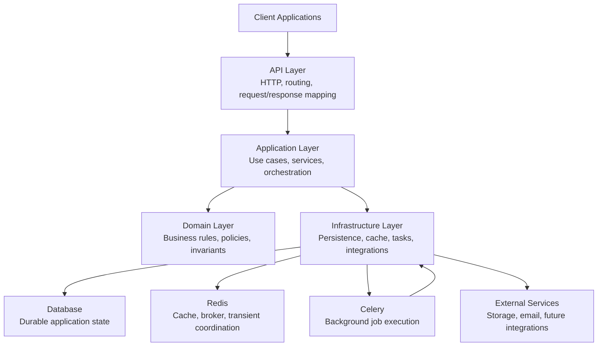
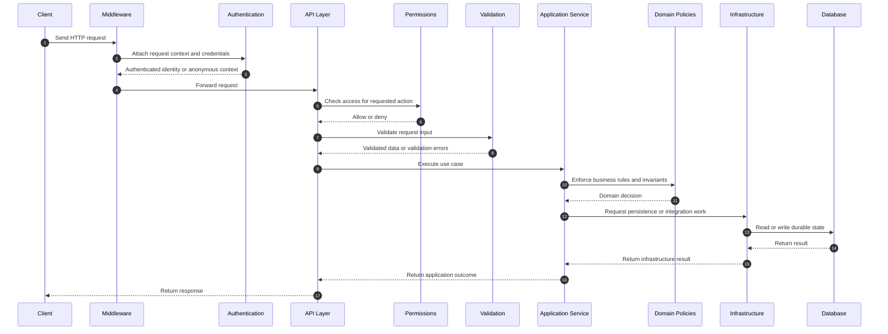
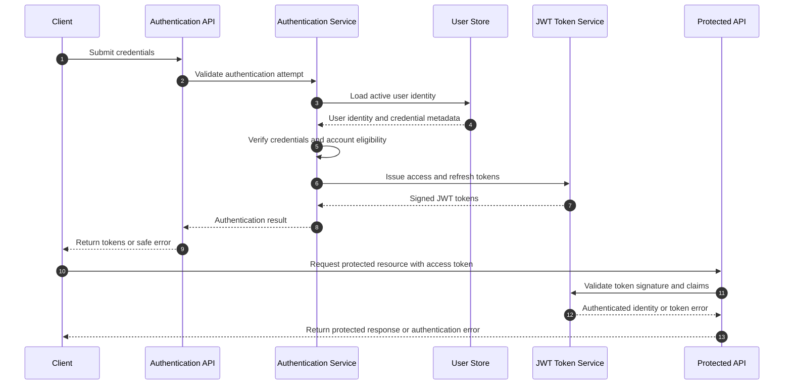
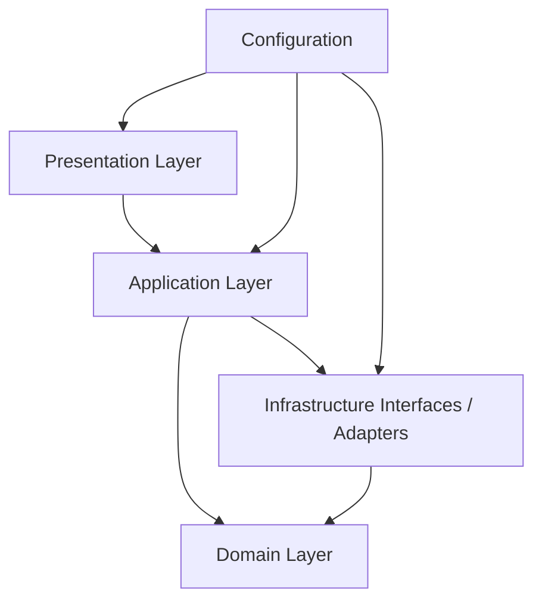

# Blogify API - System Architecture

## 1. Executive Overview

Blogify API is a production-grade REST backend for a modern blogging platform.
The system supports authentication, user profiles, posts, categories, tags,
nested comments, likes, bookmarks, search, filtering, pagination, popular and
trending posts, image upload workflows, markdown content, API documentation,
and operational health checks.

The architecture is designed as a modular monolith using layered architecture
and Clean Architecture principles. This means the application is deployed as a
single backend service, while internal responsibilities are separated into
clear layers and cohesive application modules. The goal is to achieve strong
maintainability, testability, security, and scalability without introducing
distributed system complexity that the product does not need.

This document describes how the software is organized. It defines architectural
boundaries, dependency rules, component responsibilities, request flow,
cross-cutting concerns, scalability strategy, and major architecture decisions.
It intentionally avoids implementation details such as database tables, API
endpoint paths, serializers, models, and code-level structure.

The architecture should allow a senior backend engineer to begin implementation
with clear guidance on where behavior belongs, how components communicate, and
which design constraints must be preserved.

## 2. Architectural Goals

The architecture must support the approved product vision and PRD while keeping
the codebase understandable to future maintainers and engineering reviewers.

The primary architectural goals are:

- Separate HTTP concerns from business workflows.
- Keep business logic independent from framework-specific request handling.
- Organize the system into cohesive Django apps with explicit ownership.
- Make authentication, authorization, validation, and visibility rules
  consistent across all features.
- Support public read workflows such as listing, filtering, search, and
  discovery without creating avoidable query overhead.
- Support authenticated write workflows with clear ownership and permission
  boundaries.
- Make domain behavior easy to unit test without requiring full API execution.
- Keep operational concerns such as logging, configuration, health checks,
  documentation, and error handling centralized and reusable.
- Preserve the ability to scale horizontally by keeping API processes stateless.
- Avoid unnecessary architectural patterns that add complexity without serving
  the project goals.

The architecture should optimize for long-term maintainability over speed of
initial implementation. Features should be added through established patterns
rather than one-off shortcuts.

## 3. Architecture Style

Blogify API uses Layered Architecture combined with Clean Architecture
principles.

Layered Architecture provides a practical organization model for a web backend.
The system is divided into presentation, application, domain, and
infrastructure layers. Each layer owns a specific type of responsibility, and
requests move through the layers in a predictable direction. This keeps request
handling thin, business workflows explicit, and infrastructure access isolated.

Clean Architecture principles strengthen this design by making dependency
direction explicit. High-level business rules should not depend directly on
low-level delivery mechanisms. Domain behavior should remain understandable and
testable even if API routing, persistence details, caching strategy, or
background processing choices change later.

This architecture was selected because it fits the project goals:

- It supports a professional backend structure without unnecessary
  microservice complexity.
- It keeps business logic out of views and request handlers.
- It allows service-level and domain-level tests to cover important behavior.
- It makes permissions, validation, and error behavior reusable.
- It gives reviewers a clear mental model for navigating the codebase.
- It keeps the system modular while remaining easy to run locally.

The main trade-off is that layered architecture requires discipline. If the
team bypasses services, duplicates rules across views, or lets infrastructure
details leak into domain logic, the benefits erode. The architecture therefore
depends on code review, documentation, tests, and quality gates to preserve
boundaries.

Another trade-off is that a modular monolith requires careful internal module
ownership. It does not enforce boundaries through network isolation. This is
acceptable for Blogify API because the product does not require independently
deployed services, and the operational simplicity is more valuable than
distributed-service flexibility.

## Architecture Characteristics

The architecture prioritizes characteristics that make the system clear to
implement, review, operate, and extend.

- Modularity: feature areas are separated into cohesive apps with explicit
  ownership.
- Simplicity: the system avoids architectural patterns that do not support a
  current product or engineering need.
- Predictability: similar workflows should follow similar request, validation,
  permission, service, and response patterns.
- Testability: business behavior should be verifiable through focused unit,
  service, integration, permission, and API tests.
- Security: authentication, authorization, input validation, and private data
  handling are first-class architectural concerns.
- Scalability: the API remains stateless, collections are paginated, and
  expensive work can move to cache or background processing when justified.
- Fault Isolation: failures in supporting infrastructure should be contained
  where possible and must not corrupt durable product state.
- Observability: logs, health checks, and future metrics should make system
  behavior diagnosable without exposing sensitive data.

## Quality Attributes

Quality attributes describe the non-functional expectations the architecture
must support across all modules.

Availability: the service should support production-like deployment, health
checks, stateless API processes, and clear dependency readiness signals.

Reliability: known failure modes should produce predictable outcomes, and core
workflows should be covered by meaningful automated tests.

Maintainability: modules should have clear ownership, dependencies should be
explicit, and business rules should live outside request handlers.

Performance: public read paths must support pagination, efficient filtering,
predictable ordering, and query patterns that avoid avoidable repeated work.

Security: user identity, permissions, content visibility, sensitive data, and
unsafe input must be protected consistently at architectural boundaries.

Observability: operational behavior should be traceable through structured
logs, health checks, and future monitoring hooks.

Recoverability: retryable work should be isolated, failures should be logged,
and partial writes should be avoided through clear workflow boundaries.

Extensibility: future features should extend the modular monolith through app
ownership and service contracts rather than broad rewrites.

## 4. High-Level Component Diagram



The diagram describes architectural responsibility rather than concrete files.
The API layer accepts external requests. The application layer coordinates use
cases. The domain layer defines business rules. The infrastructure layer
adapts the system to durable storage, caching, background processing, and
external integrations.

Redis, Celery, and external services are supporting components. They should be
introduced only where they solve a real product, performance, or operational
problem. The core application should remain understandable without assuming
every workflow is asynchronous or cached.

## 5. Layer Responsibilities

### Presentation Layer

The presentation layer is responsible for API-facing behavior. It receives
requests, applies request parsing, invokes authentication, delegates validation,
calls application services, and returns consistent responses.

Belongs in this layer:

- Request and response mapping.
- Authentication integration.
- Permission checks at the API boundary.
- Delegation to validators and application services.
- Pagination response formatting.
- API documentation annotations or metadata.
- Translation of known application outcomes into HTTP responses.

Should never belong in this layer:

- Multi-step business workflows.
- Ownership rules duplicated from domain policies.
- Complex query construction.
- Direct orchestration of background jobs except through application services.
- Feature-specific business decisions hidden inside request handlers.
- Cross-module business logic.

The presentation layer should be thin. Its job is to adapt the outside world to
the application, not to contain the application.

### Application Layer

The application layer coordinates product use cases. It sits between API-facing
code and lower-level domain or infrastructure concerns.

Belongs in this layer:

- Service classes or use-case functions.
- Workflow orchestration.
- Coordination across multiple domain concepts.
- Transaction boundary decisions at a workflow level.
- Calls to persistence abstractions or repositories where used.
- Calls to background task scheduling where needed.
- Conversion of domain outcomes into application-level results.

Should never belong in this layer:

- HTTP request parsing.
- Response formatting.
- Framework-specific serializer behavior.
- Database schema definitions.
- Low-level cache key mechanics scattered through workflows.
- Authorization shortcuts that bypass reusable permission policies.

The application layer is where most feature behavior should become readable.
For example, publishing a post is not merely a field update; it is a workflow
that validates author ownership, content completeness, allowed state
transition, visibility changes, and any downstream side effects.

### Domain Layer

The domain layer owns business rules and product invariants. It defines what
must be true for Blogify API to behave correctly.

Belongs in this layer:

- Ownership rules.
- Visibility rules for drafts, published content, disabled users, and private
  user activity.
- Draft and publish state transition rules.
- Comment nesting rules.
- Like and bookmark uniqueness rules.
- Taxonomy normalization and uniqueness policies.
- Moderation policies.
- Product-level validation that is independent of request format.

Should never belong in this layer:

- HTTP status codes.
- Framework request objects.
- Database connection details.
- Cache backend details.
- Celery task definitions.
- External service SDK calls.

The domain layer should be the most stable part of the system. Framework and
infrastructure decisions may evolve, but product rules should remain explicit
and portable.

### Infrastructure Layer

The infrastructure layer connects application behavior to external systems and
framework-managed resources.

Belongs in this layer:

- Database persistence and query access patterns.
- Cache reads and writes.
- Background job dispatch and execution adapters.
- File storage and image handling integrations.
- Email or notification integrations if introduced.
- API schema generation integration.
- Logging adapters and monitoring integrations.
- Environment configuration loading.

Should never belong in this layer:

- Business rules that determine whether a user may perform an action.
- Product workflow decisions.
- API response formatting.
- Request-specific validation messages that belong at the API boundary.
- Cross-feature orchestration that should be handled by services.

Infrastructure code should be replaceable where practical. The rest of the
application should not need to know whether a value came from a database,
cache, task queue, or external provider unless that distinction is part of the
product behavior.

## 6. Django App Boundaries

The project should be organized into Django apps with clear responsibility
boundaries. Apps should be cohesive, should expose only the behavior needed by
other apps, and should avoid circular dependencies.

### authentication

Owns authentication workflows and token-based access behavior. This app is
responsible for sign-in, sign-out or token invalidation behavior where
supported, token refresh behavior, credential validation boundaries, and
authentication-related security rules.

It should not own user profile presentation, post ownership rules, or content
permissions beyond authentication identity.

### users

Owns user identity, profile behavior, public profile visibility, user status,
and user-facing account metadata. It defines what user information may be
public and what remains private.

It should not own authentication token mechanics, content lifecycle behavior,
or engagement workflows.

### posts

Owns post lifecycle behavior, including draft creation, author-owned updates,
publishing, unpublishing where allowed, public visibility, markdown content
expectations, image attachment behavior, and moderation state.

It should not own category or tag catalog management, comment workflows, likes,
bookmarks, or authentication mechanics.

### comments

Owns comment creation, reply behavior, nested discussion rules, comment
visibility, comment editing or deletion rules, and moderation behavior for
discussion content.

It depends conceptually on posts for comment targets and on users for comment
ownership, but it must not duplicate post visibility rules or user status
rules. Those should be consumed through reusable policies or service contracts.

### categories

Owns category catalog behavior, category naming rules, category availability,
and category-based content grouping.

It should not own post creation or public post listing behavior. It provides
taxonomy data and rules used by posts and discovery workflows.

### tags

Owns tag catalog behavior, tag normalization, tag availability, and tag-based
content labeling.

It should not own post lifecycle behavior or discovery ranking logic. It
provides reusable tag rules and metadata to the rest of the system.

### likes

Owns post-like behavior. It enforces that authenticated users can like eligible
published posts, remove their own likes, and cannot create duplicate likes.

It should not own post visibility rules beyond consuming the eligibility rules
provided by posts or shared domain policies.

### bookmarks

Owns bookmark behavior. It enforces private saved-post state for authenticated
users, prevents duplicate bookmarks, and ensures users can access only their
own bookmark collection unless an explicit administrative rule applies.

It should not expose bookmark activity through public discovery surfaces.

### common

Owns shared reusable building blocks that are not product-domain-specific.
Examples include shared pagination behavior, common response conventions,
shared validation helpers, common permission bases, reusable exceptions,
utility types, and documentation helpers.

This app must remain disciplined. It should not become a dumping ground for
feature-specific behavior. If logic belongs to a domain app, it should stay in
that domain app.

### core

Owns project-wide operational behavior that is part of the running service:
health checks, global exception handling, logging conventions, monitoring
hooks, system metadata, and application readiness behavior.

It should not contain feature-specific business rules.

### config

Owns environment-specific configuration, settings composition, dependency
configuration, and runtime configuration validation.

It should not contain business logic, request handling, or feature workflows.
Configuration should be explicit, environment-based, and safe by default.

## Folder Structure

The repository should use a structure that makes architecture visible before a
reader opens individual files.

```text
blogify-api/
├── config/
├── apps/
│   ├── authentication/
│   ├── users/
│   ├── posts/
│   ├── comments/
│   ├── likes/
│   ├── bookmarks/
│   ├── categories/
│   ├── tags/
│   ├── common/
│   └── core/
├── services/
├── tests/
├── docs/
└── scripts/
```

`config/` contains environment-based project configuration. `apps/` contains
cohesive Django apps organized by product or platform responsibility.
Feature-specific behavior should live in the owning app, while shared
non-domain helpers belong in `apps/common/` and operational concerns belong in
`apps/core/`.

`services/` is reserved for cross-app application workflows that do not belong
cleanly to a single app. It should be used sparingly; most feature services
should remain inside their owning app. `tests/` contains project-level tests
and may mirror app boundaries for clarity. `docs/` contains planning and
engineering documentation. `scripts/` contains developer and operational helper
scripts.

This structure helps contributors understand the system quickly. It also makes
architecture review easier because app boundaries, shared concerns, tests, and
documentation are visible at the repository level.

## 7. Request Lifecycle



The request lifecycle keeps transport behavior separate from product behavior.
Middleware and authentication establish request context. API handlers enforce
boundary concerns and delegate work. Services coordinate workflows. Domain
policies protect business rules. Infrastructure performs persistence or
integration work.

Error handling may terminate the flow early at any layer. Authentication
failure, permission denial, validation failure, domain conflict, missing
resource, or infrastructure failure should each produce a consistent and safe
client response.

## 8. Authentication Flow



JWT authentication keeps API requests stateless. Protected requests should not
require server-side session storage to identify the requester. Token validation
must reject missing, expired, malformed, tampered, or unauthorized tokens.

The authentication flow must avoid leaking sensitive account details. Failed
authentication attempts should return safe, consistent errors. Token issuance,
refresh, expiration, and invalidation behavior must be documented in the API
design and tested during implementation.

## 9. Dependency Rules

Dependency direction must point inward toward business rules and outward only
through explicit application or infrastructure boundaries.

Allowed dependency direction:



The presentation layer may depend on application services, validation contracts,
permission classes, and response conventions. It must not bypass the
application layer for workflows that involve business behavior.

The application layer may depend on domain policies and infrastructure
interfaces. It may coordinate multiple domain concepts, but it should not
depend on request objects or response formatting.

The domain layer must not depend on presentation or infrastructure details. It
may define business concepts, rules, policies, and pure decision logic.

The infrastructure layer may depend on domain concepts where needed to persist
or retrieve application state, but domain rules should not depend on concrete
infrastructure adapters.

Circular dependencies between apps are not allowed. If two apps need shared
behavior, the shared contract should be moved to the appropriate owner or to a
carefully scoped common module. Cross-app communication should happen through
services, policies, or stable interfaces rather than direct access to another
app's internals.

Dependency rules should be reviewed during code review. If a feature requires
breaking a dependency rule, the architecture decision must be documented before
implementation continues.

## 10. Cross-Cutting Concerns

### Logging

Logging should follow project-wide conventions and capture security events,
unexpected errors, moderation actions, publish state changes, background job
failures, and health signals. Logs must avoid credentials, tokens, private
content, and unnecessary personal data. Request correlation or equivalent
traceability should make failures diagnosable across layers.

### Configuration

Configuration must be environment-based. Secrets, credentials, deployment
settings, service URLs, storage settings, and runtime flags must not be
hardcoded. Missing or invalid required configuration should fail fast with
clear operational feedback.

### Exception Handling

Exception handling should be centralized so clients receive consistent,
client-actionable errors. Unexpected errors should be logged and converted into
safe generic responses without exposing stack traces, secrets, infrastructure
details, or sensitive account state.

### Permissions

Permissions must be reusable and explicit. Common rules should cover anonymous
access, authenticated access, owner-only access, administrator access, and
public visibility. Sensitive workflows should be protected at the API boundary
and reinforced by service or domain policies.

### Validation

Validation must happen before workflows execute. Input validation should cover
required data, field formats, length boundaries, unsupported values, and
cross-field consistency.

Product-level invariants that are independent of request format belong in
domain policies or application services, not only in API-facing validation.

### Caching

Caching should be introduced for clear performance needs, not by default.
Candidate areas include public listings, popular or trending results, expensive
counts, and metadata responses. Cache usage must define invalidation,
freshness, and failure behavior, and the system must remain correct without
cached data.

### Pagination

Pagination is required for collections that can grow over time. Posts,
comments, bookmarks, search results, and similar resources should share
consistent defaults, maximum page sizes, stable ordering, and predictable empty
results.

### Documentation

API documentation is a required architectural component. Generated
documentation must describe inputs, responses, authentication, pagination, and
errors. Architecture and product documentation must stay aligned with
implemented behavior.

### Testing

Testing should reflect the system layers. Domain rules, service workflows, API
behavior, permissions, validation, boundaries, failures, and regressions should
all be tested with the narrowest practical test type.

### Monitoring

Monitoring should begin with health checks, structured logs, and failure
visibility. The architecture should allow future metrics for request volume,
latency, error rates, background jobs, cache behavior, and database performance
without broad redesign. Monitoring must not expose sensitive data.

## Failure Handling Philosophy

The architecture assumes failure is inevitable. Components should fail fast
when required inputs, configuration, permissions, or dependencies are invalid.
They should fail safely by returning predictable errors, avoiding sensitive data
exposure, and protecting durable state.

Application workflows should avoid partial writes by defining clear transaction
and consistency boundaries. Retry should be supported where work is naturally
retryable, such as background jobs or transient infrastructure failures.
Failures must be logged meaningfully enough to diagnose the problem without
leaking private user data, credentials, tokens, or infrastructure secrets.

## 11. Scalability Considerations

### Horizontal Scaling

The API should be stateless so multiple application instances can run behind a
load balancer. Authentication should not require per-process session state.
Shared state belongs in durable storage or dedicated infrastructure such as
Redis where appropriate.

Stateless API processes make scaling simpler and support production-like
deployment without requiring microservices.

### Redis

Redis may support caching, rate limiting, transient coordination, and Celery
broker or result workflows depending on final technical design. Redis should be
treated as supporting infrastructure, not as the source of truth for core
product data.

The system must define acceptable behavior when cached data is unavailable or
expired. Cache failures should not corrupt durable product state.

### Background Jobs

Background jobs should handle work that is slow, retryable, or not required to
complete before responding to the client. Candidate work includes image
processing, notification delivery, search indexing, popularity aggregation, and
maintenance tasks.

Jobs should be idempotent where possible. Retry behavior, failure handling, and
user-visible outcomes must be defined before introducing asynchronous
processing.

### Stateless APIs

JWT-based authentication supports stateless API requests. Statelessness reduces
server affinity requirements and allows instances to be added or removed more
easily.

Stateful workflows, if introduced, must be stored in shared durable or
supporting infrastructure rather than memory local to a single process.

### Database Optimization

The database remains the source of truth. Architecture must support efficient
access patterns for public listings, post detail views, comments, likes,
bookmarks, search, filtering, and trending or popular content.

Database optimization should include indexing strategy, relationship loading
strategy, pagination, uniqueness constraints, and careful query design. Specific
schema decisions belong in the database design document.

### Future Extensibility

Future features should extend the modular monolith through clear app ownership
and service contracts. New capabilities such as account verification,
scheduled publishing, notifications, advanced search, analytics, or moderation
queues should not require rewriting core boundaries.

The architecture should allow growth through modularity first. Extraction into
separate services should remain a future option, not a starting assumption.

## 12. Design Principles

### SOLID

The system should follow SOLID principles where they improve clarity and
maintainability. Classes and modules should have focused responsibilities.
Behavior should be open to extension through well-defined services or policies
without requiring risky modification of unrelated code.

SOLID should not be used as an excuse for unnecessary indirection. The goal is
clear ownership and replaceable boundaries, not pattern density.

### DRY

Business rules, permission checks, validation conventions, error formats, and
pagination behavior should not be duplicated across apps. Shared behavior
should be extracted when duplication creates maintenance risk.

DRY must be balanced with readability. Similar code should not be abstracted
too early if the abstraction hides important product differences.

### KISS

The simplest design that satisfies the product and quality requirements should
be preferred. The system should avoid speculative infrastructure and advanced
patterns that do not solve a present problem.

KISS does not mean under-engineered. It means the architecture should be
understandable, direct, and proportionate to the requirements.

### Composition Over Inheritance

Reusable behavior should generally be composed from services, policies,
validators, and helper components. Inheritance should be used when it matches
the framework model or clearly reduces duplication without obscuring behavior.

Composition keeps dependencies explicit and makes behavior easier to test.

### Explicit Dependencies

Dependencies should be visible through service boundaries, constructor
dependencies, function parameters, or documented module contracts. Hidden
global coupling makes code harder to reason about and test.

Explicit dependencies also make architecture reviews easier because reviewers
can see how features communicate.

### Thin Views

Views or API handlers should remain thin. They should authenticate, authorize,
validate, delegate to services, and return responses. They should not contain
business workflows or complex query behavior.

Thin views protect maintainability and make application services the natural
place to test product behavior.

### Service Layer

The service layer coordinates use cases and protects domain workflows from API
transport concerns. Services should be named around product actions and should
make business steps readable.

Service methods should be small enough to review but complete enough to express
the workflow they own.

### Reusable Permissions

Permissions should be reusable across features. Common patterns include public
read access, authenticated write access, owner-only modification,
administrator-only moderation, and combined owner-or-admin behavior.

Reusable permissions reduce security drift and make negative permission tests
more systematic.

### Environment-Based Configuration

Configuration must come from the environment or documented configuration
sources. The application must not rely on hardcoded secrets or local-only
assumptions.

Environment-based configuration supports local development, automated tests,
CI/CD, and production-like deployment.

## Architectural Constraints

These constraints protect the architecture during implementation. They are more
specific than product constraints and should be enforced through code review,
tests, and architecture decision records.

- Business rules may never exist inside views or API handlers.
- Views cannot access infrastructure directly for business workflows.
- Views must delegate use cases to application services.
- Services cannot depend on the presentation layer.
- Domain logic cannot import Django REST Framework or HTTP-specific concepts.
- Infrastructure cannot dictate business rules.
- Cross-app access must happen through stable services, policies, or documented
  interfaces rather than another app's internals.
- Feature-specific behavior must not be placed in `common`.
- Configuration must not contain business logic.
- Public discovery workflows must always apply visibility and permission rules.
- Background jobs must not bypass domain rules or authorization-sensitive
  service workflows.
- Cache state must never be the source of truth for durable product behavior.

If a feature appears to require violating one of these constraints, the team
should document the trade-off in an ADR before implementation proceeds.

## 13. Architecture Decision Summary

The most important architectural decisions are:

- Blogify API will be built as a modular monolith rather than microservices.
- REST is the primary API style.
- Layered Architecture and Clean Architecture principles define responsibility
  boundaries.
- API handlers remain thin and delegate business workflows to services.
- Business rules live in domain policies and application services, not request
  handlers.
- Django apps are organized by cohesive product responsibility:
  authentication, users, posts, comments, categories, tags, likes, bookmarks,
  common, core, and config.
- JWT authentication supports stateless API requests.
- Authorization and visibility rules are reusable and must be tested across
  anonymous, authenticated, owner, non-owner, and administrator scenarios.
- Redis and Celery are supporting infrastructure, introduced where they solve
  caching, coordination, or background processing needs.
- The database is the source of truth for durable product state.
- Public collection behavior must support pagination, filtering, predictable
  ordering, and visibility enforcement.
- Logging, exception handling, configuration, documentation, pagination, and
  testing are cross-cutting architecture concerns.
- API documentation is part of the system contract and must stay aligned with
  implementation.
- The architecture explicitly excludes Kubernetes, GraphQL, CQRS, event
  sourcing, and unnecessary distributed infrastructure from the initial design.

These decisions support the approved vision: a focused, production-style
backend that demonstrates clean architecture, maintainability, security,
testability, and operational readiness without overengineering.

## Related ADRs

The following ADRs should be created or linked as the architecture is finalized:

- ADR-001 Layered Architecture
- ADR-002 Modular Monolith
- ADR-003 Service Layer
- ADR-004 Database Strategy
- ADR-005 UUID Strategy

These ADRs will provide focused decision records for the architectural choices
summarized in this document.
