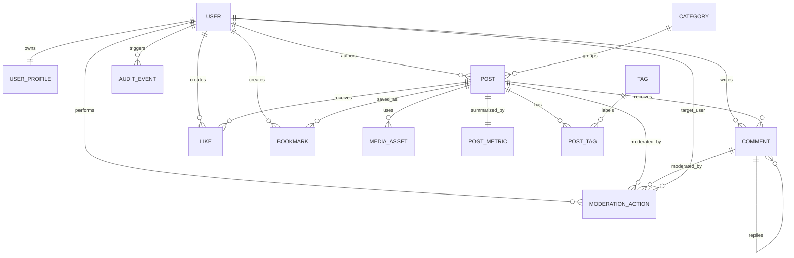

# Blogify API - Database Design

## Executive Overview

Blogify API uses a relational database as the source of truth for durable
product state. The database design supports authenticated users, public
profiles, posts, draft and publish workflow, categories, tags, nested comments,
likes, bookmarks, media attachments, moderation records, audit history, and
discovery features such as search, filtering, popular posts, and trending
posts.

This document describes the logical database architecture. It does not define
Django models, SQL, migrations, serializers, API endpoints, or implementation
code. Its purpose is to define the entities, relationships, integrity rules,
indexing strategy, data lifecycle decisions, and scalability considerations
needed before implementation begins.

The design follows the approved architecture: a modular monolith with clear app
boundaries, reusable business rules, thin API handlers, application services,
and explicit ownership of domain behavior. The database model must support
those boundaries without forcing business logic into persistence details.

## Design Goals

The database design is optimized for correctness, maintainability, and
production readiness.

- Preserve data integrity through explicit relationships and constraints.
- Support clear ownership and visibility rules for users, posts, comments,
  likes, and bookmarks.
- Keep public discovery queries efficient through planned indexes and
  normalized relationships.
- Support draft and publish workflow without exposing private content.
- Support nested comments while preventing unbounded complexity.
- Prevent duplicate likes, bookmarks, categories, tags, and post-tag
  associations.
- Keep audit and moderation history separate from user-facing content.
- Use soft deletion where preserving references and auditability matters.
- Avoid premature denormalization while allowing targeted derived data for
  performance-sensitive discovery features.
- Keep the model extensible for future features such as scheduled publishing,
  revision history, advanced moderation, notifications, and analytics.

The main trade-off is balancing normalization with read performance. The
initial design favors normalized entities for clarity and integrity, with
targeted aggregate entities only where product requirements justify them.

## Entity Inventory

The logical entity set is:

| Entity | Primary Responsibility | Owning App |
| --- | --- | --- |
| User | Authenticated account identity and account status | users |
| UserProfile | Public and editable profile information | users |
| Post | Authored content and draft/publish lifecycle | posts |
| Category | Primary content grouping | categories |
| Tag | Flexible content labels | tags |
| PostTag | Many-to-many relationship between posts and tags | posts/tags |
| Comment | Threaded discussion on published posts | comments |
| Like | User engagement expressing positive feedback on a post | likes |
| Bookmark | Private saved-post relationship for a user | bookmarks |
| MediaAsset | Uploaded or attached media metadata for post content | posts |
| PostMetric | Derived engagement and discovery counters for posts | posts |
| ModerationAction | Administrative action taken on content or users | core |
| AuditEvent | Security-relevant or operationally important event record | core |

This inventory is intentionally focused. It avoids entities for features that
are future enhancements, such as notifications, following, revision history,
editorial approval queues, and analytics dashboards.

## Entity Responsibilities

### User

The User entity represents account identity. It owns authentication identity,
account status, role eligibility, and durable identity used by authored content
and engagement records.

Why: content ownership, private bookmarks, comments, likes, and administrative
actions all require a stable user reference.

Trade-off: keeping account identity separate from profile data prevents public
profile concerns from leaking into authentication and security workflows.

### UserProfile

The UserProfile entity stores public-facing profile information and editable
profile metadata.

Why: profile data has different visibility and lifecycle rules than account
identity. Separating it supports strict public/private boundaries.

Trade-off: this adds one relationship for profile reads, but it keeps sensitive
account state separate from public representation.

### Post

The Post entity represents authored content. It owns title, body content,
author relationship, publication state, visibility state, lifecycle timestamps,
and content metadata required for discovery.

Why: posts are the central product entity and must support draft visibility,
public publishing, markdown content, moderation, filtering, search, and
engagement.

Trade-off: post records carry several lifecycle concerns. Keeping those
concerns in one entity is acceptable because they describe one aggregate:
authored publishable content.

### Category

The Category entity represents a controlled content grouping. A post belongs to
one category when categorized.

Why: categories support structured browsing and stable editorial organization.

Trade-off: categories are less flexible than tags but easier for readers to
navigate. Keeping category as a separate entity allows administrative control
and consistent filtering.

### Tag

The Tag entity represents flexible content labels. Posts may have multiple
tags.

Why: tags support discovery across content themes without forcing a single
hierarchy.

Trade-off: tags need normalization rules to avoid duplicates caused by case,
spacing, or formatting variations.

### PostTag

PostTag represents the association between posts and tags.

Why: many-to-many relationships require a distinct logical association so
uniqueness and future metadata can be managed cleanly.

Trade-off: an association entity adds query complexity but preserves
normalization and allows future extension such as tag ordering or source.

### Comment

The Comment entity represents user discussion on published posts. It supports
reply relationships for nested comments.

Why: comments need ownership, moderation, visibility, ordering, and nesting
rules independent of post content.

Trade-off: nested comments can become expensive if modeled without limits. The
design requires a maximum depth or equivalent product limit to keep reads and
moderation manageable.

### Like

The Like entity represents one user's positive engagement with one post.

Why: likes are user-specific and must enforce uniqueness while supporting
counts and current-user state.

Trade-off: storing likes as rows rather than only counters supports correctness
and user-specific behavior. Counters can be derived or cached separately.

### Bookmark

The Bookmark entity represents one user's private saved-post relationship.

Why: bookmarks are private user activity and must not leak into public
discovery surfaces.

Trade-off: bookmarks look similar to likes structurally, but separating them
keeps privacy rules and user workflows explicit.

### MediaAsset

The MediaAsset entity represents metadata about uploaded or attached media used
by posts.

Why: media requires validation, ownership, attachment state, and lifecycle
tracking separate from post text.

Trade-off: storing media metadata does not imply storing binary content in the
relational database. The storage mechanism is an infrastructure decision.

### PostMetric

The PostMetric entity represents derived post-level counters and ranking
signals, such as like count, comment count, bookmark count where appropriate,
and discovery scores.

Why: popular and trending post workflows need efficient reads and deterministic
ranking. Recomputing counts for every request can become expensive.

Trade-off: derived data introduces consistency risk. It must be updated through
controlled workflows and treated as rebuildable from source entities.

### ModerationAction

The ModerationAction entity records administrative action against users, posts,
or comments.

Why: moderation changes should be auditable and explainable without overloading
the moderated entity itself.

Trade-off: a generalized moderation record is flexible but must be carefully
validated so it does not become vague or inconsistent.

### AuditEvent

AuditEvent records security-relevant and operationally important events such
as authentication failures, privileged actions, content state changes, and
system-level events.

Why: audit records support accountability, debugging, and production-style
review.

Trade-off: audit data can grow quickly. Retention and archival policies should
be defined before production-scale usage.

## Relationship Design

The core relationships are:

- A User has one UserProfile.
- A User authors many Posts.
- A User creates many Comments.
- A User creates many Likes.
- A User creates many Bookmarks.
- A User performs many ModerationActions when acting as an administrator.
- A Post belongs to one User as author.
- A Post may belong to one Category.
- A Post may have many Tags through PostTag.
- A Post has many Comments.
- A Post has many Likes.
- A Post has many Bookmarks.
- A Post may have many MediaAssets.
- A Post has one PostMetric record.
- A Category groups many Posts.
- A Tag relates to many Posts through PostTag.
- A Comment belongs to one Post.
- A Comment belongs to one User as author.
- A Comment may have one parent Comment.
- A Comment may have many child Comments.
- A Like belongs to one User and one Post.
- A Bookmark belongs to one User and one Post.
- A ModerationAction references the administrator and the moderated target.
- An AuditEvent references the actor when one exists.

Relationships should preserve ownership, visibility, and lifecycle semantics.
Foreign keys should be used for stable relationships where referential
integrity is required. Polymorphic or generic references should be avoided
unless the flexibility is clearly worth the loss of relational strictness.

## Mermaid ER Diagram

The diagram shows logical relationships only. It intentionally omits physical
columns, SQL types, framework-specific field names, and migration details.

## UUID Strategy

Publicly addressable primary identifiers should use UUIDs.

Why: UUIDs avoid exposing sequential record counts, reduce predictability in
URLs and API clients, and allow safer future data movement if records ever need
to be generated outside a single database sequence.

Trade-offs:

- UUIDs are larger than integer identifiers and can have less favorable index
  locality.
- They are better for public identifiers but slightly heavier for storage and
  joins.

Design decision:

- Use UUIDs for externally visible entities such as users, posts, comments,
  categories, tags, media assets, likes, and bookmarks.
- Avoid relying on UUIDs as a security boundary. Authorization and visibility
  checks remain mandatory.
- Use stable slugs only where a human-readable public lookup is valuable, such
  as posts, categories, or tags. Slugs must not replace immutable identifiers.

Future implication: if the system later introduces imports, exports, or
distributed job workflows, UUID identifiers reduce coordination risk compared
with sequential public identifiers.

## Foreign Key Strategy

Foreign keys should enforce ownership and relationship integrity for core
entities.

Design decisions:

- User-owned records should reference User directly.
- Post-owned records such as comments, likes, bookmarks, media assets, and
  metrics should reference Post directly.
- PostTag should reference both Post and Tag.
- Comment replies should use a self-reference to the parent comment.
- Category relationships should be nullable only if product rules allow
  uncategorized drafts or posts.
- ModerationAction should reference concrete target entities where practical.

Delete behavior should protect data integrity:

- User deletion should not physically remove authored public content by
  default. Account status and anonymization policies should be used where
  required.
- Post deletion should not accidentally orphan public engagement or comments.
  Soft deletion is preferred for content lifecycle.
- Category or tag removal should be restricted when active public content uses
  them, or handled through explicit deactivation.
- Comment deletion should preserve discussion structure where replies exist.

Trade-off: strict foreign keys reduce accidental data corruption but require
careful lifecycle rules. This is a good trade-off for a production-style
portfolio backend because correctness is more important than shortcut deletion.

## Constraints

Database-level constraints should reinforce product rules that must never be
violated, even if application logic has a defect.

Required logical constraints:

- User account identity must be unique according to the chosen login
  identifier.
- Each User has at most one UserProfile.
- Category normalized name must be unique.
- Tag normalized name must be unique.
- Post slug should be unique within the chosen public uniqueness scope.
- PostTag must be unique per Post and Tag pair.
- Like must be unique per User and Post pair.
- Bookmark must be unique per User and Post pair.
- PostMetric must be unique per Post.
- Comment parent and child relationships must belong to the same Post.
- Comment nesting must respect the product's maximum depth rule.
- Publication timestamps must be consistent with publication state.
- Soft-deleted records must not appear in public discovery queries.

Some rules are best enforced by the database, while others require application
or domain validation. For example, unique likes are a strong database
constraint. Comment depth requires domain-level validation and may also be
supported by stored depth metadata.

Trade-off: database constraints can make invalid states impossible, but complex
business rules may become difficult to express purely in the database. The
design should use database constraints for invariants and services/domain rules
for workflows.

## Index Strategy

Indexes should be planned around the most important read and write workflows.
They should support performance without adding unnecessary write overhead.

Primary index categories:

- Identity indexes for login identifiers, public UUIDs, and public slugs.
- Ownership indexes for records commonly filtered by user.
- Visibility indexes for public content queries.
- Lifecycle indexes for draft, published, deleted, disabled, and moderated
  states.
- Taxonomy indexes for category and tag filtering.
- Engagement indexes for likes, bookmarks, and metrics.
- Comment indexes for post-level comment retrieval and nested ordering.
- Search-supporting indexes for post title, body, author, category, and tag
  discovery fields where appropriate.
- Audit indexes for actor, target, event type, and event time.

Important query patterns:

- List published posts ordered by publication time.
- Retrieve posts by author.
- Filter published posts by category.
- Filter published posts by tag.
- Search published posts by content and metadata.
- Retrieve comments for a post in stable order.
- Retrieve replies for a comment.
- Retrieve a user's bookmarks.
- Check whether a user liked or bookmarked a post.
- Rank popular or trending posts.
- Retrieve moderation or audit history by actor, target, type, and time.

Trade-off: indexes speed reads but slow writes and increase storage. The
initial design should index known product-critical access patterns, then add
new indexes based on measured query behavior.

## Audit Fields

Most durable entities should include audit metadata.

Recommended audit concepts:

- Created timestamp.
- Updated timestamp.
- Soft-deleted timestamp where soft deletion applies.
- Created-by actor where the actor may differ from the owner.
- Updated-by actor for administrative or privileged modifications where useful.

Why: audit fields support debugging, moderation, operational review, and
interview-grade production readiness.

Trade-off: audit metadata adds storage and implementation discipline. The value
is high because content systems need clear lifecycle history and accountability.

Audit fields are not a replacement for AuditEvent. Entity-level audit fields
capture lifecycle metadata. AuditEvent captures notable system or security
events.

## Soft Delete Strategy

Soft deletion should be used for user-generated content and engagement records
when historical integrity, auditability, or relationship preservation matters.

Soft delete should apply to:

- Posts.
- Comments.
- Media assets.
- Categories and tags through deactivation where needed.
- User profiles or user availability state where account removal requires
  preserving authored content.

Likes and bookmarks may use physical deletion for user intent, unless audit or
analytics requirements justify soft deletion. The first release should keep
private user engagement simple and avoid retaining deleted private activity
without a clear product reason.

Why: soft deletion prevents broken references, supports moderation review, and
allows public discovery to exclude unavailable content without destroying
history.

Trade-offs:

- Every public query must filter unavailable or soft-deleted records.
- Unique constraints may need to account for active versus deleted records.
- Data retention policy must be documented as the product matures.

Soft deletion must never be used as a substitute for authorization. Hidden
records still require permission and visibility enforcement.

## Normalization

The initial database design should be normalized around distinct business
concepts.

Normalization decisions:

- Separate User from UserProfile.
- Separate Post from Category and Tag.
- Represent Post and Tag as a many-to-many relationship through PostTag.
- Separate Comment from Post.
- Separate Like and Bookmark even though their shapes are similar.
- Separate MediaAsset from Post body content.
- Separate PostMetric as derived data rather than mixing all counters into
  user-facing content records.
- Separate ModerationAction and AuditEvent from the entities they reference.

Why: normalization reduces duplication, makes ownership clearer, and improves
data integrity.

Trade-off: normalized reads can require more joins. The design addresses this
with index planning, relationship loading strategy, and targeted derived data
for discovery workflows.

Denormalization should be introduced only when a measured or strongly expected
read path justifies it. When denormalized values exist, they should be treated
as derived and rebuildable.

## Data Integrity

Data integrity must be enforced at multiple levels:

- Database constraints for uniqueness, required relationships, and referential
  integrity.
- Domain rules for lifecycle transitions, visibility, ownership, and comment
  depth.
- Application services for multi-step workflows and consistency boundaries.
- Tests for permission-sensitive, state-sensitive, and concurrency-sensitive
  behavior.

Critical integrity rules:

- Draft posts must never appear in public discovery surfaces.
- Disabled users must not appear as active public participants.
- Comments must belong to a valid post.
- Comment replies must remain within the same post.
- Likes and bookmarks must be unique per user and post.
- Post metrics must remain consistent with source engagement records or be
  rebuildable.
- Administrative moderation must leave a traceable state change or record.

Trade-off: enforcing rules in more than one place can feel redundant, but it is
appropriate for critical invariants. Database constraints prevent impossible
states; domain services make rule intent readable.

## Performance

The database design must support efficient access for the product's primary
read paths:

- Public post listings.
- Post detail views.
- Author profile and author post views.
- Category and tag filtering.
- Search.
- Comment trees.
- Like and bookmark state for authenticated users.
- Popular and trending post discovery.

Performance decisions:

- Use indexes for high-frequency filters and sorts.
- Keep public collection queries scoped to visible, published, available
  content.
- Keep default and maximum page sizes to prevent unbounded reads.
- Store engagement source records for correctness.
- Use PostMetric or equivalent derived records for expensive aggregate reads.
- Avoid loading unnecessary relationships in list views.
- Treat search as a planned access pattern, not an afterthought.

Trade-off: aggregate records improve discovery reads but introduce consistency
work. The design accepts this only for ranking and counters where repeated
real-time aggregation would be wasteful.

## Scalability

The logical design supports future growth without requiring a different
architecture.

Scalability considerations:

- UUIDs support safer future imports and distributed workflows.
- Normalized ownership boundaries support app-level modularity.
- Pagination prevents unbounded collections.
- Indexes support predictable public discovery queries.
- PostMetric supports read-heavy engagement and ranking features.
- AuditEvent and ModerationAction can be retained, archived, or partitioned in
  the future if volume grows.
- Media metadata is separate from binary storage, allowing storage strategy to
  evolve independently.

The design does not assume internet-scale traffic in the first release. It is
structured so performance can be improved incrementally through indexes,
caching, background aggregation, read replicas, or archival strategies if real
needs appear.

## Security

Database design must reinforce security and privacy rules.

Security decisions:

- Public profile data is separated from account identity.
- Private bookmarks are stored separately and never included in public
  discovery relationships.
- Moderation and audit data are separate from public representations.
- Soft-deleted and disabled records remain protected by visibility rules.
- Authentication identity must be unique and protected.
- Administrative actions require actor tracking.
- Sensitive data should be minimized and excluded from public read models.

Trade-off: storing audit and moderation data increases responsibility for
access control and retention. The benefit is stronger accountability and
production-grade traceability.

The database should never be treated as the only security layer. Authorization
must remain enforced in services and API boundaries.

## Future Extensibility

The model leaves room for planned future enhancements without weakening the
initial release.

Potential extensions:

- Account verification and password recovery entities.
- Follow relationships between users.
- Scheduled publishing fields or scheduling entities.
- Post revision history.
- Editorial review workflows.
- Comment reporting queues.
- Notification delivery records.
- Advanced media processing records.
- Search index synchronization state.
- Author analytics and event aggregation.
- API key or integration credentials.

Future additions should preserve current ownership and visibility rules.
Entities should be added when they represent a durable business concept, not
just because an implementation detail needs a temporary place to live.

## Decision Summary

Key database design decisions:

- Use a relational database as the source of truth.
- Use UUIDs for publicly addressable durable entities.
- Separate account identity from public profile data.
- Model posts as the central authored content entity.
- Use one category per post and many tags per post.
- Use PostTag as an explicit many-to-many association.
- Use self-referential comments with a maximum nesting policy.
- Store likes and bookmarks as source records with uniqueness per user and
  post.
- Keep bookmarks private and separate from public engagement.
- Store media metadata separately from post text.
- Use PostMetric for derived counters and ranking support.
- Use ModerationAction and AuditEvent for traceability.
- Prefer soft deletion for content where references and auditability matter.
- Use database constraints for hard invariants and services/domain policies for
  workflow rules.
- Plan indexes around public discovery, ownership, lifecycle state, engagement,
  and audit access patterns.

These decisions support maintainability, testability, security, performance,
and future growth while keeping the first release focused.

## Related ADRs

The following ADRs record the major database decisions behind this document:

- ADR-004 Database Strategy
- ADR-005 UUID Strategy

Future database-related decisions, such as search indexing, audit retention,
or media storage, should be added as separate ADRs when those designs are
finalized.

## Implementation Readiness Checklist

Before implementation begins, confirm the following:

- Entity ownership is agreed across apps.
- User and profile visibility rules are finalized.
- Post lifecycle states are finalized.
- Category and tag normalization rules are finalized.
- Comment maximum nesting depth is defined.
- Soft delete behavior is defined for each entity.
- Unique constraints are mapped to product rules.
- Foreign key delete behavior is defined for each relationship.
- Indexes are planned for required listing, filtering, search, and engagement
  workflows.
- PostMetric update and rebuild strategy is defined.
- ModerationAction target strategy is finalized.
- AuditEvent retention expectations are documented.
- Media metadata requirements are separated from binary storage decisions.
- Security review confirms private and public data boundaries.
- Performance review confirms primary query patterns are covered.
- Future enhancement entities are intentionally excluded from initial scope.

When these items are complete, an experienced backend engineer should be able
to implement the data model without making additional architectural
assumptions.
