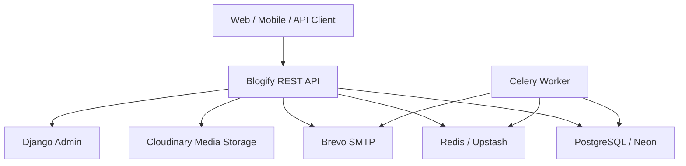
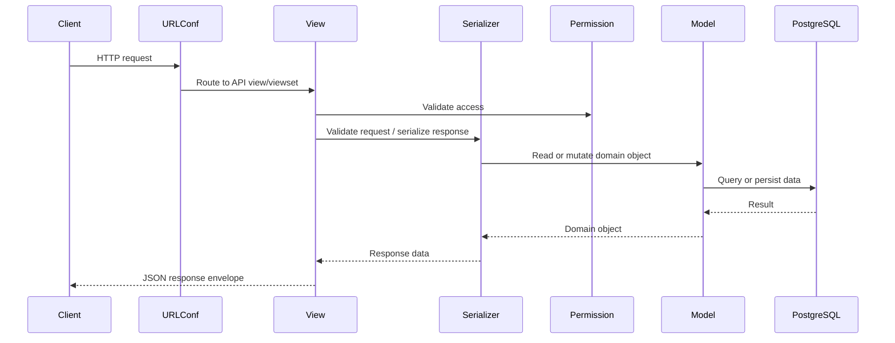

# Blogify API Architecture

## Overview

Blogify API is organized as a modular Django REST Framework application. The codebase follows a modular monolith structure with clear app boundaries, shared framework utilities, and production-ready infrastructure concerns separated from domain behavior.

The architecture is intentionally simple: HTTP clients interact with versioned REST APIs, API views delegate validation and persistence to Django/DRF components, domain models remain inside feature apps, asynchronous work is delegated to Celery, PostgreSQL is the source of truth, Redis supports background processing, and provider integrations are configured through environment variables.

## System Context

## Runtime Components

| Component | Responsibility |
| --- | --- |
| `config` | Settings, URL routing, WSGI/ASGI, Celery application wiring |
| `apps/accounts` | Custom user model, JWT auth, registration, email verification |
| `apps/posts` | Post publishing workflow, post visibility, filtering, search |
| `apps/content` | Categories and tags |
| `apps/comments` | Comments and one-level replies |
| `apps/likes` | Post likes and unlike behavior |
| `apps/bookmarks` | User bookmark management |
| `apps/notifications` | Notification model, creation services, read APIs |
| `apps/common` | Shared API response, exception, permission, pagination, model, and utility foundations |
| `apps/core` | Health check, infrastructure tasks, startup management commands |

## Request Flow

## Architectural Characteristics

- Modularity through Django app boundaries.
- Predictable REST endpoints under `/api/v1/`.
- PostgreSQL as source of truth.
- Redis-backed background task infrastructure.
- Explicit production configuration through environment variables.
- Clear separation between public API, admin UI, background jobs, and provider integrations.
- Testability through reusable common framework components and pytest coverage.

## Design Constraints

- The application is a modular monolith, not a microservice system.
- GraphQL, CQRS, event sourcing, Kubernetes, and distributed service orchestration are intentionally excluded.
- Business behavior should stay inside feature apps and reusable services, not in deployment scripts.
- Provider-specific production settings must remain environment-driven.

## Related Documentation

- [02_System_Architecture.md](02_System_Architecture.md)
- [05_Implementation_Blueprint.md](05_Implementation_Blueprint.md)
- [adr/README.md](adr/README.md)
