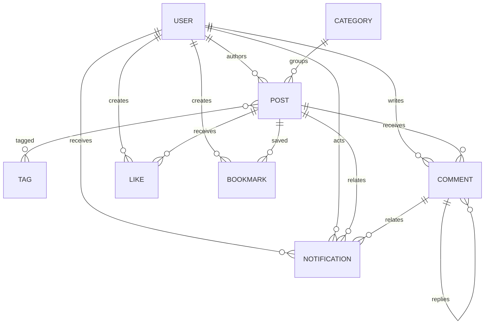
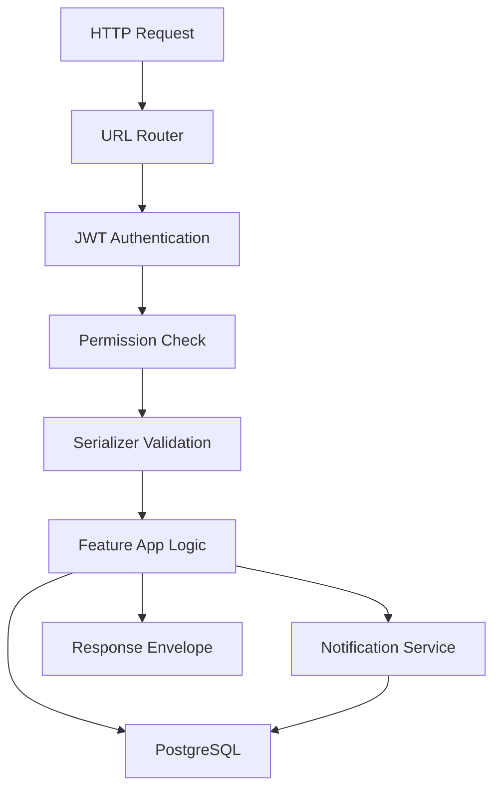

# System Design

## Data Model Summary

| Model | Responsibility |
| --- | --- |
| `User` | Account identity, email login, profile metadata, staff/admin flags |
| `Category` | Staff-managed post grouping |
| `Tag` | Staff-managed post labels |
| `Post` | Author-owned blog content with draft/published workflow |
| `Comment` | User comments and one-level replies on published posts |
| `Like` | Unique user-to-post like relation |
| `Bookmark` | Unique user-to-post bookmark relation |
| `Notification` | User-facing notification records |

## Relationship Overview

## Key Business Rules

- Draft posts are visible only to their author and staff/admin users.
- Published posts are publicly readable.
- Only authors and staff/admin users can edit or delete posts.
- Comments are allowed only on published posts.
- Only one level of comment replies is supported.
- Likes and bookmarks are unique per user and post.
- Users can access only their own notifications.
- Staff/admin users manage categories and tags.

## Request Lifecycle

## Design Decisions

- A modular monolith keeps deployment simple while preserving domain boundaries.
- PostgreSQL is the durable source of truth.
- UUID identifiers are used for public entities.
- Redis is used for Celery broker/result backend and future cache expansion.
- Celery handles email delivery and scheduled infrastructure tasks.
- Cloudinary is used for production media storage.
- WhiteNoise removes the need for Nginx for static files on Render.
- The API uses a consistent JSON response envelope.
- OpenAPI documentation is generated by drf-spectacular.

## Related ADRs

See [adr/README.md](adr/README.md).
